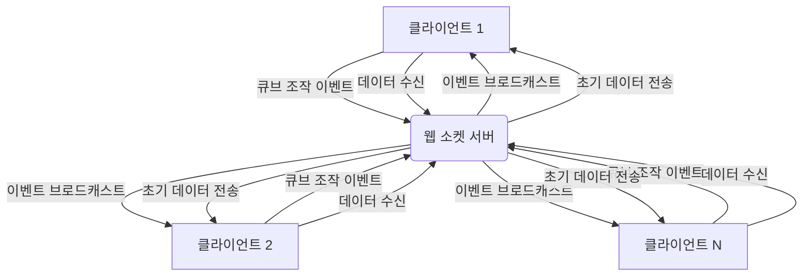

# 다중 사용자 기능 구현 계획 (Socket.IO 활용)

## 목표

현재 단일 사용자 구조의 Cuberse 웹 애플리케이션을 여러 사용자가 동시에 접속하여 실시간으로 큐브를 조작하고 상호작용할 수 있는 다중 사용자 환경으로 확장합니다.

## 기술 스택

*   **서버:** Node.js, Express, Socket.IO
*   **클라이언트:** HTML, JavaScript (Three.js), Socket.IO-client

## 계획

Socket.IO 라이브러리를 사용하여 서버와 클라이언트 간의 실시간 양방향 통신을 구현합니다.

### 1. 서버 설정 (server.js)

*   Express 서버에 Socket.IO를 통합하여 웹 소켓 기능을 활성화합니다.
*   새로운 클라이언트가 접속하면 고유한 소켓 연결을 설정하고 관리합니다.
*   클라이언트로부터 발생하는 큐브 조작 이벤트 (추가, 삭제, 이동 등)를 수신합니다.
*   수신된 큐브 조작 이벤트를 해당 공간에 있는 다른 모든 연결된 클라이언트에게 브로드캐스트하여 씬을 동기화합니다.
*   클라이언트 연결 해제 시 해당 사용자의 정보를 정리하는 로직을 추가합니다.
*   (선택 사항) Zone 시스템과 연동하여 각 Zone을 Socket.IO의 '방(room)'으로 활용합니다. 사용자가 Zone을 이동하면 해당 방에서 나가고 새로운 방에 참여하도록 처리하여 통신량을 최적화합니다.

### 2. 클라이언트 설정 (src/main-legacy.js)

*   HTML 파일에 Socket.IO 클라이언트 라이브러리를 추가합니다.
*   클라이언트 애플리케이션 시작 시 서버와 웹 소켓 연결을 설정합니다.
*   사용자의 큐브 조작(마우스 클릭, 드래그 등) 이벤트가 발생하면, 변경된 큐브의 정보와 작업 유형을 포함하여 서버로 해당 이벤트를 전송합니다.
*   서버로부터 다른 사용자의 큐브 조작 이벤트를 수신합니다.
*   수신된 이벤트 데이터를 기반으로 Three.js 씬에서 해당 큐브를 추가, 삭제 또는 이동하여 모든 클라이언트의 씬 상태를 실시간으로 동기화합니다.
*   (선택 사항) Zone 이동 시 현재 Zone ID를 서버에 전송하여 해당 Zone의 방에 참여하도록 요청합니다.

### 3. 데이터 동기화

*   **초기 동기화:** 새로운 클라이언트가 서버에 접속했을 때, 서버는 현재 씬에 존재하는 모든 큐브 데이터를 해당 클라이언트에게 전송하여 초기 씬 상태를 구성하도록 합니다.
*   **실시간 동기화:** 큐브 조작 이벤트 발생 시, 변경된 큐브의 고유 식별자 (또는 위치), 새로운 위치, 색상, 작업 유형 (예: 'add', 'remove', 'move') 등 최소한의 정보만 서버를 통해 다른 클라이언트에게 전송하여 효율적인 데이터 동기화를 수행합니다.

### 4. 데이터 관리

*   현재 로컬 스토리지에 큐브 데이터를 저장하는 방식은 다중 사용자 환경에 적합하지 않습니다.
*   서버 측에서 모든 큐브 데이터를 중앙 집중식으로 관리합니다. 간단한 메모리 상의 객체나 배열을 사용할 수도 있고, 영구적인 저장을 위해 파일 시스템 또는 데이터베이스 (예: SQLite, MongoDB 등)를 연동하는 것을 고려할 수 있습니다. 초기 단계에서는 메모리 저장을 사용하고 필요에 따라 확장합니다.

## Mermaid 다이어그램

## 세부 구현 단계 (예상)

1.  `package.json` 파일에 `socket.io` 및 `socket.io-client` 의존성을 추가하고 `npm install` 명령어를 실행하여 설치합니다.
2.  `server.js` 파일을 수정하여 HTTP 서버와 Socket.IO 서버를 함께 구동하고, 클라이언트 연결 및 이벤트 처리를 위한 기본 로직을 구현합니다.
3.  `public/index.html` 파일에 Socket.IO 클라이언트 라이브러리 스크립트 태그를 추가합니다.
4.  `src/main-legacy.js` 파일을 수정하여 서버와 웹 소켓 연결을 설정하고, 큐브 조작 이벤트 발생 시 서버로 데이터를 전송하는 로직을 구현합니다.
5.  서버로부터 수신된 큐브 조작 이벤트를 처리하여 3D 씬을 업데이트하는 로직을 `src/main-legacy.js`에 추가합니다.
6.  새로운 클라이언트 접속 시 서버에서 현재 큐브 데이터를 전송하고 클라이언트에서 이를 받아 씬을 초기화하는 로직을 구현합니다.
7.  기존 로컬 스토리지 저장/로드 로직을 제거하고 서버 측 데이터 관리 로직으로 대체합니다.
8.  (선택 사항) Zone 이동 시 Socket.IO 방 참여/나가기 로직을 구현합니다.
9.  구현된 기능을 테스트하고 디버깅합니다.

## 다음 단계

계획 검토 후 승인해주시면, 다음 모드(예: Code 모드)로 전환하여 계획에 따라 실제 코드를 수정하고 기능을 구현하겠습니다.